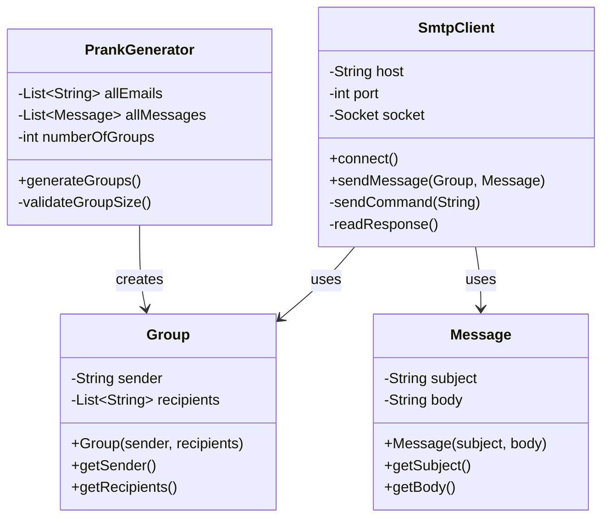

# SMTP Mock Server Prank Generator

A Java application that sends prank emails to groups of victims using a mock SMTP server.

## Project Description

This application allows you to:
- Configure a list of victims (email addresses)
- Configure prank messages
- Generate random groups of 2-5 people
- Send prank emails where one member of each group appears to send an email to others

## Setup Mock SMTP Server

1. Make sure Docker is installed on your system
2. Run MailDev:
```bash
docker run -d -p 1080:1080 -p 1025:1025 maildev/maildev
```
3. Check that the web interface is accessible at http://localhost:1080

## Running a Prank Campaign

### Configuration Files

1. `mail.txt`: One email address per line
```
alice@example.com
bob@example.com
charlie@example.com
```

2. `prank.txt`: Messages with subject and body
```
subject:First Prank
This is the content of the first prank
;endOfPrank;

subject:Second Prank
This is another prank message
;endOfPrank;
```

### Running the Application

1. Compile:
```bash
javac org/example/model/*.java
javac org/example/ClientTCP.java
```

2. Run (replace X with number of groups):
```bash
java org.example.ClientTCP X
```

3. Check results in MailDev web interface (http://localhost:1080)

## Implementation Details

### Class Diagram



### Key Components

- **Group**: Manages sender and recipients for a prank
- **Message**: Stores email subject and body
- **PrankGenerator**: Creates random groups and assigns messages
- **SmtpClient**: Handles SMTP communication
- **InputValidator**: Validates configuration files and inputs

### Example SMTP Dialogue

```
CLIENT: EHLO localhost
SERVER: 250-maildev ESMTP
CLIENT: MAIL FROM: <sender@example.com>
SERVER: 250 Accepted
CLIENT: RCPT TO: <victim1@example.com>
SERVER: 250 Accepted
CLIENT: DATA
SERVER: 354 End data with <CR><LF>.<CR><LF>
[Email content]
CLIENT: .
SERVER: 250 Message queued
CLIENT: QUIT
SERVER: 221 Bye
```